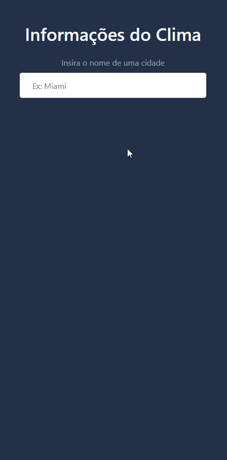

     

# ⛈️ Weather App

> Trata-se de uma aplicação web que busca, exibe e persiste informações   meteorológicas da cidade buscada.

---

## 🛠️ Tecnologias Utilizadas
- HTML
- CSS + Bootstrap
- JavaScript

## ✍️ O que pratiquei
- Operações assíncronas
  - fetch API
  - Promises
    - then/catch
    - async/await
- Lançamento e tratamento de erros
  - throw
  - try/catch
- Refatoração de código
  - Eliminação de funções com múltiplas responsabilidades
- Persistir dados no lado do cliente
  - Utilização do mecanismo Local Storage da Web Storage API
- Factory functions

## 🔗 Links
Para acessar a aplicação basta clicar [aqui](https://weather-app-sigma-six.vercel.app/).

---

Desenvolvido com ❤️ por Gabriel Ramos Nogueira

